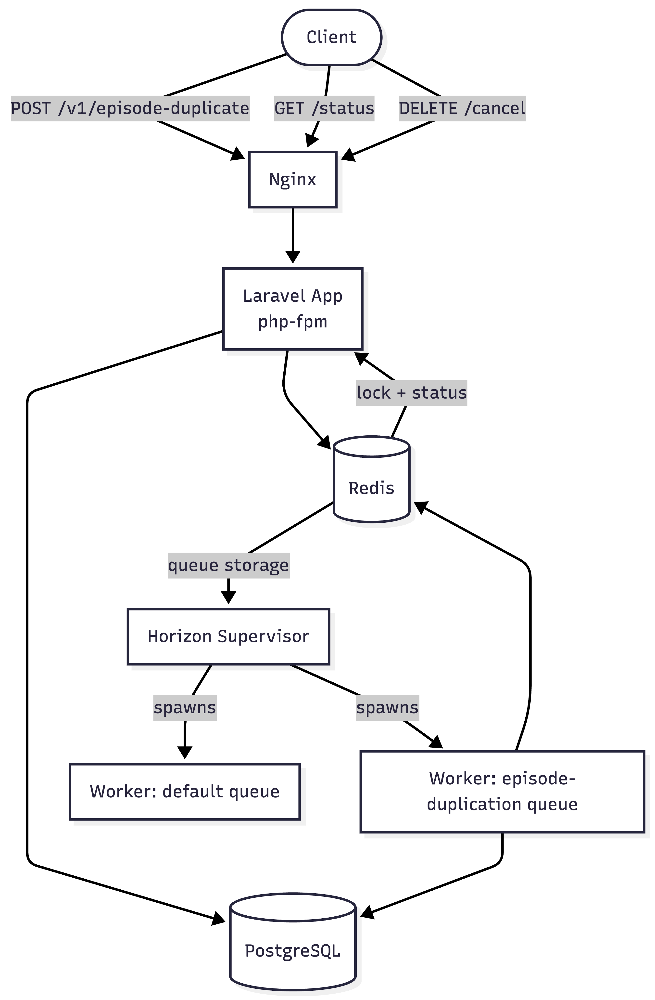
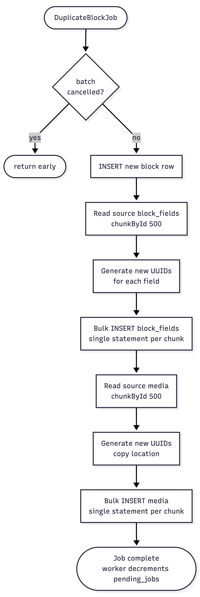
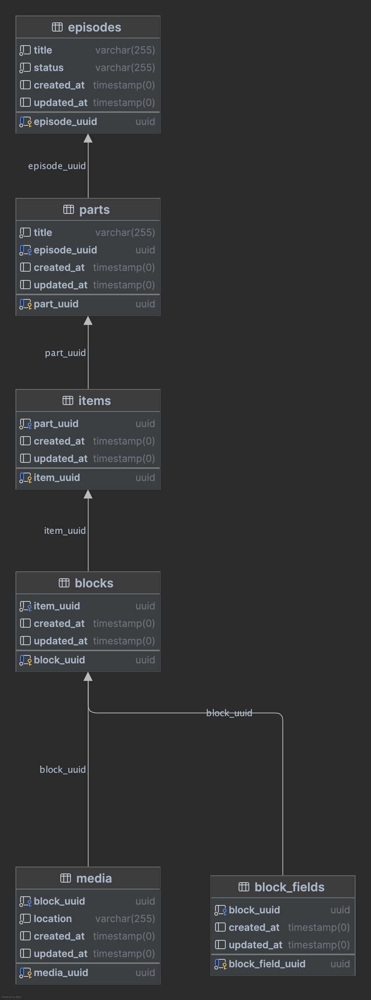

Architecture Diagram available at [Mermaid Live Editor](https://mermaid.ai/d/f0e315af-ba33-46f7-b6e4-0151138862ea)

Duplicate Episode workflow diagram available at [Mermaid Live Editor](https://mermaid.ai/d/1524b44a-cc98-4011-adb1-9878ce025741):

## Services 
1. postgresql - Database
2. redis - Used directly for Locking and Status storage
3. horizon - Supervisor for workers
4. nginx - Reverse proxy
5. laravel - PHP application

## Database Schema - generated using PHPStorm

# Production Deployment checklist for AWS

What we need and why:

1. ECR — private Docker image registry inside AWS
2. RDS PostgreSQL — managed database, AWS handles backups and failover
3. ElastiCache Redis — managed Redis for queues and locks
4. ECS Fargate — runs our containers, no servers to manage
5. ALB — load balancer, replaces nginx, handles HTTPS
